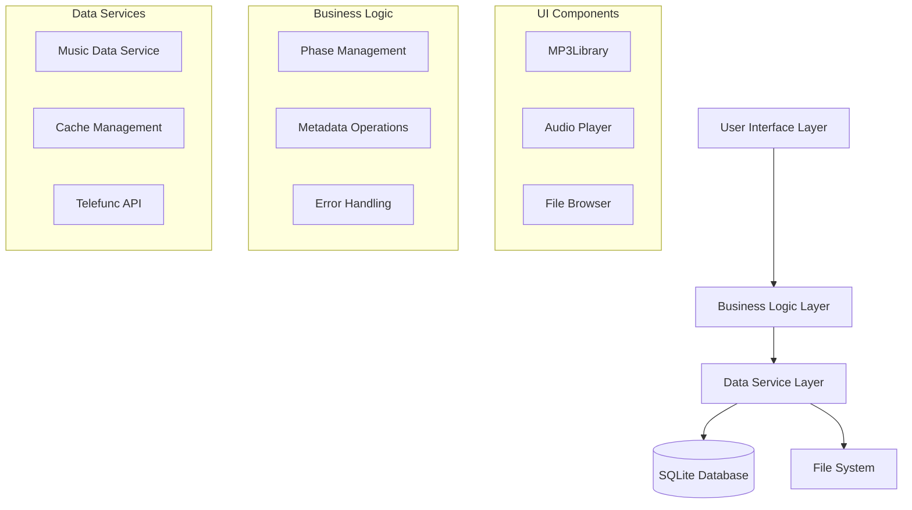
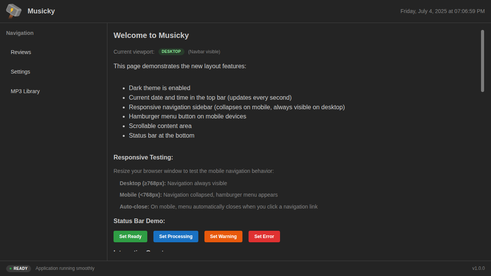
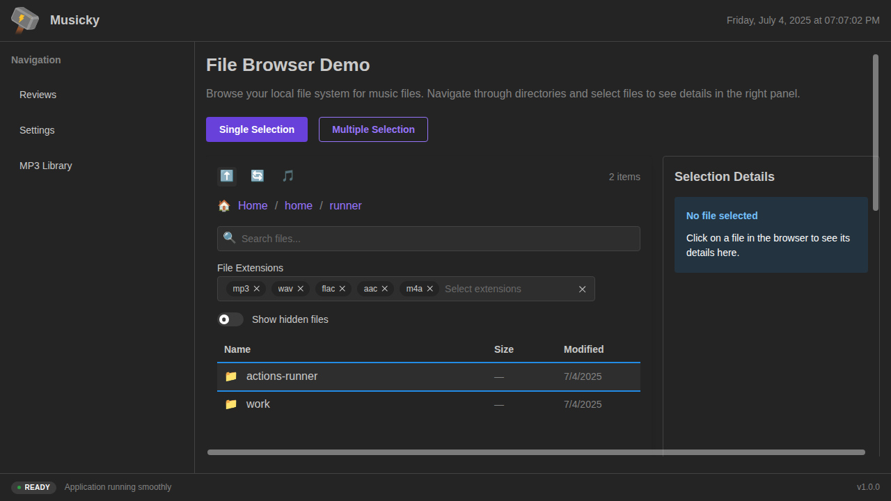
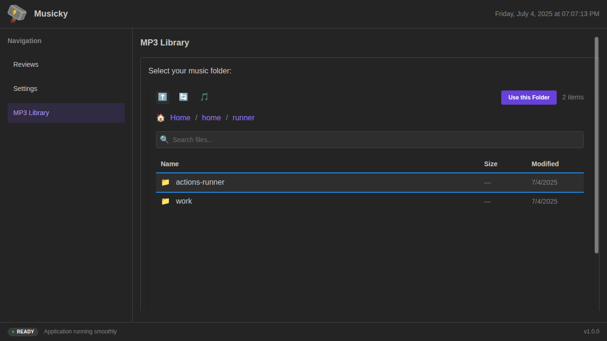
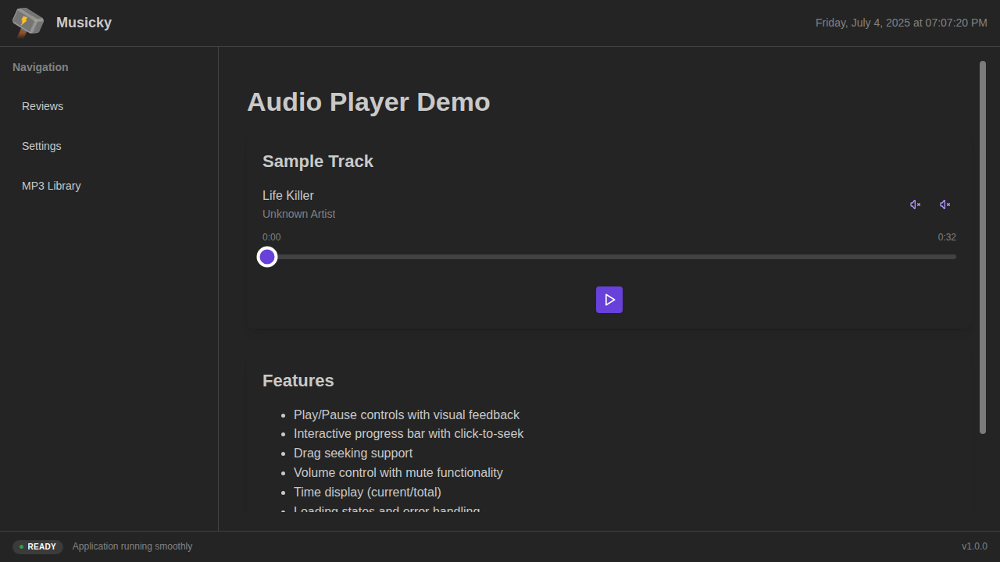
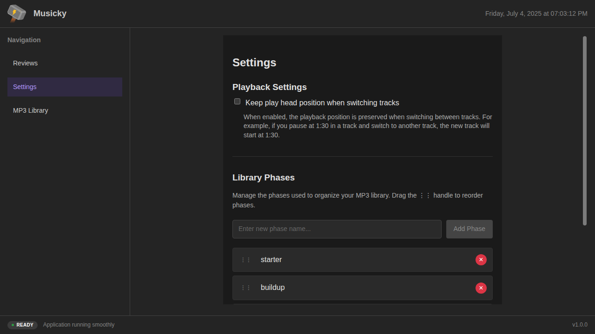
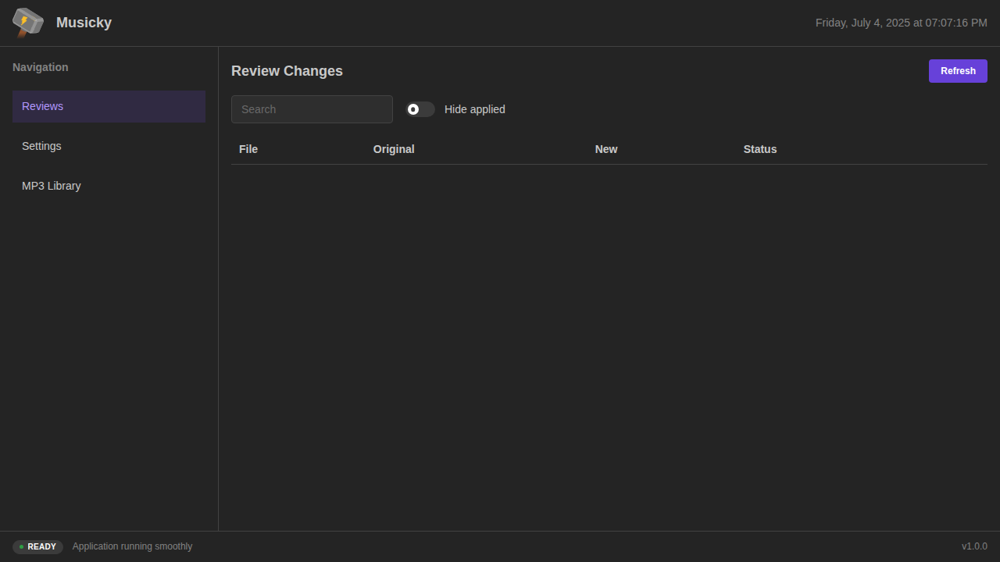
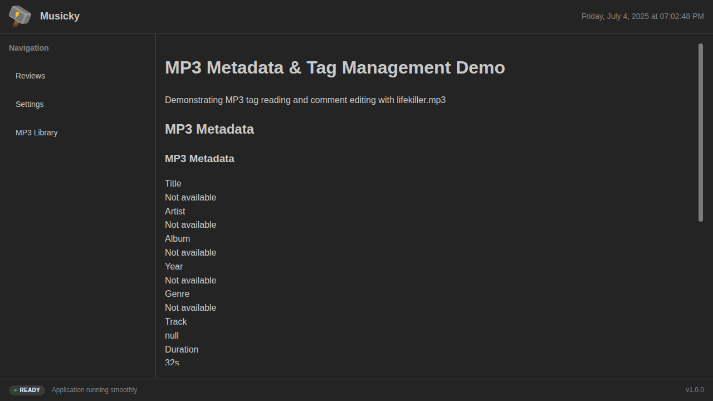
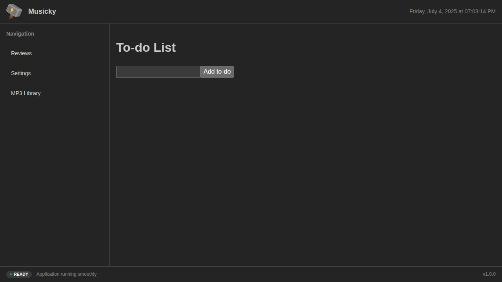

# 🎵 Musicky

> A modern, production-ready music library management application for local music collections.

Musicky helps you organize, browse, and play your local MP3 files with advanced features like phase tagging, metadata editing, and a responsive audio player.

## ✨ Features

- **🗂️ Smart File Browsing** - Navigate your music collection with security-first folder access
- **🎵 Audio Player** - Full-featured player with volume control, progress tracking, and playlist support  
- **🏷️ Phase Tagging** - Organize tracks by phases (starter, buildup, peak, release, feature)
- **✏️ Metadata Editing** - Edit MP3 tags and comments with pending edit management
- **📱 Responsive Design** - Works seamlessly on desktop and mobile devices
- **🔒 Security First** - Restricted file access and input validation
- **⚡ High Performance** - Optimized data loading and caching

## 🏗️ Architecture

Musicky follows a **stratified design** with clear separation of concerns:


```mermaid
graph TB
    UI[User Interface Layer]
    BL[Business Logic Layer]
    DL[Data Service Layer]
    DB[(SQLite Database)]
    FS[File System]

    UI --> BL
    BL --> DL
    DL --> DB
    DL --> FS

    subgraph "UI Components"
        MP3[MP3Library]
        AP[Audio Player]
        FB[File Browser]
    end

    subgraph "Business Logic"
        PH[Phase Management]
        MD[Metadata Operations]
        ER[Error Handling]
    end

    subgraph "Data Services"
        MS[Music Data Service]
        CS[Cache Management]
        API[Telefunc API]
    end
```

### 🎯 Key Design Principles

- **Deep Modules**: Complex functionality hidden behind simple interfaces
- **Information Hiding**: Implementation details abstracted from consumers  
- **Single Responsibility**: Each module has one clear purpose
- **Stratified Design**: Clear layers with minimal coupling

## 🚀 Quick Start

### 📋 Prerequisites

- Node.js 18+ and npm
- Local MP3 music collection

### ⚙️ Installation

```bash
# Clone and install dependencies
git clone https://github.com/abossard/musicky.git
cd musicky
npm install

# Set up database
echo "DATABASE_URL=./database.sqlite" > .env
npm run sqlite:migrate

# Start development server
npm run dev

# Open http://localhost:3000
```

### 🚀 Production Deployment

```bash
# Build for production
npm run build

# Start production server
npm run preview
```

## 📱 User Guide

### 🎵 Setting Up Your Music Library

1. Navigate to **Settings** page
2. Set your **Base Folder** to your music directory
3. The app will automatically scan for MP3 files

### 🏷️ Phase Tagging System

Organize your tracks using hashtag-based phases:

- `#starter` - Opening tracks
- `#buildup` - Building energy  
- `#peak` - High energy moments
- `#release` - Wind-down tracks
- `#feature` - Special highlights

### 🎧 Audio Player Features

- **Play Control**: Click the play button next to any track
- **Volume Control**: Adjust using the slider
- **Progress Tracking**: Automatically saves your position
- **Queue Management**: Add tracks to your play queue

## 🔧 Technical Stack

- **Frontend**: React 18, TypeScript, Mantine UI
- **Backend**: Fastify server with Telefunc RPC
- **Database**: SQLite with Better-SQLite3
- **Build System**: Vite with Vike framework
- **Audio**: HTML5 Audio API with metadata extraction

## 📁 Project Structure

```
musicky/
├── api/                    # Telefunc API endpoints
│   └── file-browser.telefunc.ts
├── assets/                 # Static assets
│   └── logo.svg
├── components/             # React UI components
│   ├── AudioPlayer/        # Audio player components
│   │   ├── AudioPlayer.tsx
│   │   ├── PlayerControls.tsx
│   │   ├── ProgressBar.tsx
│   │   └── VolumeControl.tsx
│   ├── FileBrowser.tsx     # File browser component
│   ├── MP3Library.tsx      # Main library interface
│   ├── Settings.tsx        # Settings management
│   └── GlobalAudioPlayer.tsx # Global audio player
├── contexts/               # React contexts
│   └── StatusContext.tsx   # Global status management
├── database/               # SQLite database
│   ├── sqlite/             # Database configuration
│   │   ├── db.ts          # Database connection
│   │   ├── queries/       # SQL queries
│   │   └── schema/        # Database schemas
│   └── schema/            # Data schemas
├── hooks/                  # Custom React hooks
│   ├── use-music-library.ts # Music library hooks
│   ├── useAudioQueue.ts    # Audio queue management
│   └── useStatus.ts        # Status context hook
├── layouts/                # Page layouts
│   ├── LayoutDefault.tsx   # Main layout with sidebar
│   └── theme.ts           # Mantine theme configuration
├── lib/                    # Business logic and utilities
│   ├── music-data-service.ts # Centralized data management
│   ├── mp3-business-logic.ts # Pure business functions
│   ├── error-manager.ts     # Error handling system
│   ├── file-browser.ts      # File system operations
│   └── audio-*.ts          # Audio-related utilities
├── pages/                  # Vike page components
│   ├── index/             # Homepage
│   ├── mp3-library/       # MP3 library page
│   ├── file-browser/      # File browser demo
│   ├── audio-player/      # Audio player page
│   ├── settings/          # Settings page
│   ├── review-changes/    # Review changes page
│   └── todo/             # Todo example
├── scripts/               # Build and utility scripts
│   └── capture-screenshots.js
├── server/                # Server configuration
│   ├── db-middleware.ts   # Database middleware
│   ├── telefunc-handler.ts # Telefunc handler
│   └── vike-handler.ts    # Page rendering
├── screenshots/           # Application screenshots
└── tests/                # Test files
    └── mp3-metadata.test.ts
```

## 🛡️ Security Features

- **Path Restriction**: File access limited to user's home directory
- **Input Validation**: All user inputs validated and sanitized
- **XSS Prevention**: Proper escaping of user content
- **CSRF Protection**: Built into Telefunc RPC system

## 🔄 Data Flow

1. **User Action** → UI Component
2. **Business Logic** → Pure calculation functions  
3. **Data Service** → Centralized data management
4. **API Layer** → Telefunc handlers
5. **Database/Files** → SQLite + File system

## 🎯 Performance Optimizations

- **Smart Caching**: Intelligent data caching with selective refresh
- **Lazy Loading**: Components loaded on demand
- **Bundle Optimization**: Code splitting and tree shaking
- **Database Indexing**: Optimized queries for large libraries

## 🧪 Development

### ✅ Running Tests

```bash
npm run test          # Run unit tests
npm run test:e2e      # Run end-to-end tests
```

### 🔍 Code Quality

```bash
npm run lint          # ESLint checking
npm run build         # Production build validation
```

### 📐 Architecture Guidelines

Follow these principles when contributing:

1. **Keep modules deep** - Hide complexity behind simple interfaces
2. **Separate calculations from actions** - Pure functions vs side effects
3. **Use stratified design** - Clear layering with minimal coupling
4. **Minimize state complexity** - Centralized, predictable state management

## 📚 API Reference

### 🎵 Music Data Service

```typescript
// Load all library data
const data = await musicDataService.loadLibraryData();

// Refresh specific data type
await musicDataService.refresh('files');

// Update single file
musicDataService.updateFile(updatedFile);
```

### ⚙️ Business Logic Functions

```typescript
// Pure calculations
const phases = extractPhases(comment);
const newComment = togglePhaseInComment(comment, 'peak');

// File operations  
const updatedFile = await togglePhaseForFile(filePath, 'starter');
```

## 📖 Development Guidelines

### For Contributors

Musicky follows rigorous design principles to maintain code quality and reduce complexity:

- **[Contributing Guide](CONTRIBUTING.md)**: Complete development practices, design principles, and contribution workflow
- **[Copilot Usage Guide](COPILOT_GUIDE.md)**: Effective prompting strategies for test-first development and maintaining architecture
- **[Architecture Documentation](docs/design/architecture.md)**: Four-layer architecture (Domain, Application, Infrastructure, Adapters)
- **[Invariants Documentation](docs/design/invariants.md)**: System-wide and module-specific invariants
- **[ADR-0001: Module Boundaries](docs/decisions/ADR-0001-module-boundaries.md)**: Architectural decisions and layer separation strategy

### Key Principles

1. **Deep Modules**: Hide complexity behind simple, intuitive interfaces
2. **Actions vs Calculations**: Separate pure functions (domain) from side effects (infrastructure)
3. **Stratified Design**: Clear layering with unidirectional dependencies
4. **Invariants**: Document and maintain conditions that must always be true
5. **Test-First Development**: Write tests before implementation (TDD)

### Test Strategy

- **Unit Tests** (`tests/unit/`): Pure business logic, 100% coverage goal
- **Integration Tests** (`tests/integration/`): Module interactions with real dependencies
- **E2E Tests** (`tests/e2e/`): Complete user workflows
- **BDD Scenarios** (`features/`): Gherkin-style acceptance criteria

## 🤝 Contributing

1. **Read the Guidelines**: Start with [CONTRIBUTING.md](CONTRIBUTING.md) for detailed practices
2. **Fork the Repository**: Create your own fork of the project
3. **Create a Feature Branch**: `git checkout -b feat/your-feature-name`
4. **Follow Architecture**: Respect the four-layer architecture (see [docs/design/architecture.md](docs/design/architecture.md))
5. **Write Tests First**: TDD approach - tests before implementation
6. **Run Quality Checks**:
   ```bash
   npm run lint          # Code style and quality
   npm run test          # All tests
   npm run build         # Production build
   ```
7. **Submit a Pull Request**: Use the PR template (see [.github/PULL_REQUEST_TEMPLATE.md](.github/PULL_REQUEST_TEMPLATE.md))

### Commit Message Convention

Use conventional commit prefixes:
- `feat:` - New features
- `fix:` - Bug fixes
- `refactor:` - Code restructuring
- `test:` - Test additions/updates
- `docs:` - Documentation changes
- `chore:` - Maintenance tasks

## 📄 License

This project is licensed under the MIT License - see the [LICENSE](LICENSE) file for details.

---

## 📸 Screenshots

### 🏠 Homepage


### 📁 File Browser  


### 🎵 MP3 Library


### 🎧 Audio Player


### ⚙️ Settings


### 📝 Review Changes


### 🎵 MP3 Demo


### ✅ Todo Example


---

Built with ❤️ for music lovers who want to organize and play their local music collections.

**Technology Credits**: Generated with [vike.dev/new](https://vike.dev/new) and enhanced for production use.

