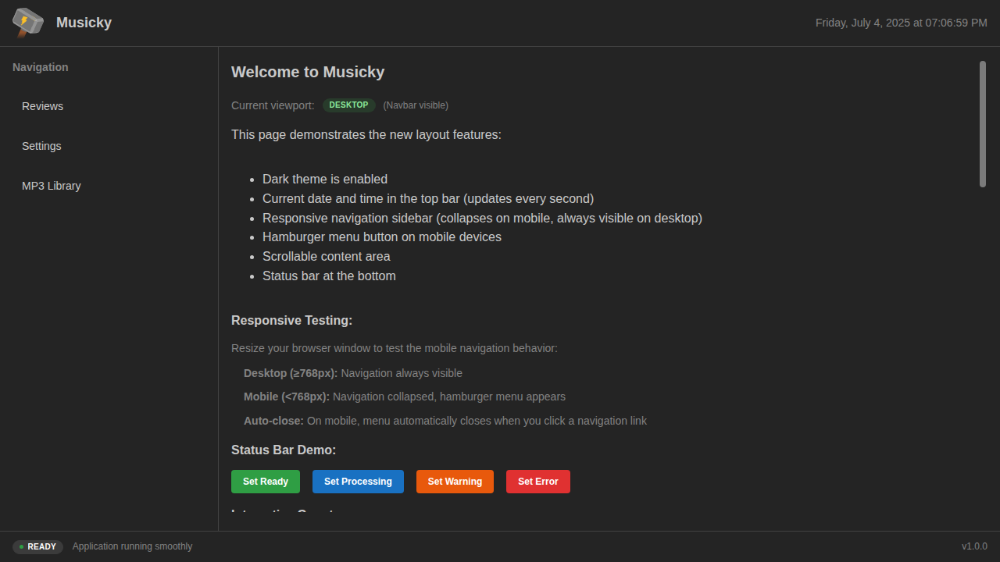

# 🎵 Musicky

> A modern, production-ready music library management application for local music collections.

Musicky helps you organize, browse, and play your local MP3 files with advanced features like phase tagging, metadata editing, and a responsive audio player.

## ✨ Features

- **🗂️ Smart File Browsing** - Navigate your music collection with security-first folder access
- **🎵 Audio Player** - Full-featured player with volume control, progress tracking, and playlist support  
- **🏷️ Phase Tagging** - Organize tracks by phases (starter, buildup, peak, release, feature)
- **✏️ Metadata Editing** - Edit MP3 tags and comments with pending edit management
- **📱 Responsive Design** - Works seamlessly on desktop and mobile devices
- **🔒 Security First** - Restricted file access and input validation
- **⚡ High Performance** - Optimized data loading and caching

## 🏗️ Architecture

Musicky follows a **stratified design** with clear separation of concerns:


### Key Design Principles

- **Deep Modules**: Complex functionality hidden behind simple interfaces
- **Information Hiding**: Implementation details abstracted from consumers  
- **Single Responsibility**: Each module has one clear purpose
- **Stratified Design**: Clear layers with minimal coupling

## 🚀 Quick Start

### Prerequisites

- Node.js 18+ and npm
- Local MP3 music collection

### Installation

```bash
# Clone and install dependencies
git clone https://github.com/abossard/musicky.git
cd musicky
npm install

# Set up database
echo "DATABASE_URL=./database.sqlite" > .env
npm run sqlite:migrate

# Start development server
npm run dev

# Open http://localhost:3000
```

### Production Deployment

```bash
# Build for production
npm run build

# Start production server
npm run preview
```

## 📱 User Guide

### Setting Up Your Music Library

1. Navigate to **Settings** page
2. Set your **Base Folder** to your music directory
3. The app will automatically scan for MP3 files

### Phase Tagging System

Organize your tracks using hashtag-based phases:

- `#starter` - Opening tracks
- `#buildup` - Building energy  
- `#peak` - High energy moments
- `#release` - Wind-down tracks
- `#feature` - Special highlights

### Audio Player Features

- **Play Control**: Click the play button next to any track
- **Volume Control**: Adjust using the slider
- **Progress Tracking**: Automatically saves your position
- **Queue Management**: Add tracks to your play queue

## 🔧 Technical Stack

- **Frontend**: React 18, TypeScript, Mantine UI
- **Backend**: Fastify server with Telefunc RPC
- **Database**: SQLite with Better-SQLite3
- **Build System**: Vite with Vike framework
- **Audio**: HTML5 Audio API with metadata extraction

## 📁 Project Structure

```
musicky/
├── components/          # React UI components
│   ├── MP3Library.tsx   # Main library interface
│   └── AudioPlayer/     # Audio player components
├── lib/                 # Business logic and utilities
│   ├── music-data-service.ts    # Centralized data management
│   ├── mp3-business-logic.ts    # Pure business functions
│   └── error-manager.ts         # Error handling system
├── hooks/               # React hooks
│   └── use-music-library.ts     # Simplified data hooks
├── database/            # SQLite schema and queries
└── pages/              # Vike page components
```

## 🛡️ Security Features

- **Path Restriction**: File access limited to user's home directory
- **Input Validation**: All user inputs validated and sanitized
- **XSS Prevention**: Proper escaping of user content
- **CSRF Protection**: Built into Telefunc RPC system

## 🔄 Data Flow

1. **User Action** → UI Component
2. **Business Logic** → Pure calculation functions  
3. **Data Service** → Centralized data management
4. **API Layer** → Telefunc handlers
5. **Database/Files** → SQLite + File system

## 🎯 Performance Optimizations

- **Smart Caching**: Intelligent data caching with selective refresh
- **Lazy Loading**: Components loaded on demand
- **Bundle Optimization**: Code splitting and tree shaking
- **Database Indexing**: Optimized queries for large libraries

## 🧪 Development

### Running Tests

```bash
npm run test          # Run unit tests
npm run test:e2e      # Run end-to-end tests
```

### Code Quality

```bash
npm run lint          # ESLint checking
npm run build         # Production build validation
```

### Architecture Guidelines

Follow these principles when contributing:

1. **Keep modules deep** - Hide complexity behind simple interfaces
2. **Separate calculations from actions** - Pure functions vs side effects
3. **Use stratified design** - Clear layering with minimal coupling
4. **Minimize state complexity** - Centralized, predictable state management

## 📚 API Reference

### Music Data Service

```typescript
// Load all library data
const data = await musicDataService.loadLibraryData();

// Refresh specific data type
await musicDataService.refresh('files');

// Update single file
musicDataService.updateFile(updatedFile);
```

### Business Logic Functions

```typescript
// Pure calculations
const phases = extractPhases(comment);
const newComment = togglePhaseInComment(comment, 'peak');

// File operations  
const updatedFile = await togglePhaseForFile(filePath, 'starter');
```

## 🤝 Contributing

1. Fork the repository
2. Create a feature branch (`git checkout -b feature/amazing-feature`)
3. Follow the architecture guidelines
4. Ensure tests pass (`npm run test`)
5. Submit a pull request

## 📄 License

This project is licensed under the MIT License - see the [LICENSE](LICENSE) file for details.

---

## Screenshots

### Homepage


### File Browser  


### MP3 Library


### Audio Player


---

Built with ❤️ for music lovers who want to organize and play their local music collections.

**Technology Credits**: Generated with [vike.dev/new](https://vike.dev/new) and enhanced for production use.

