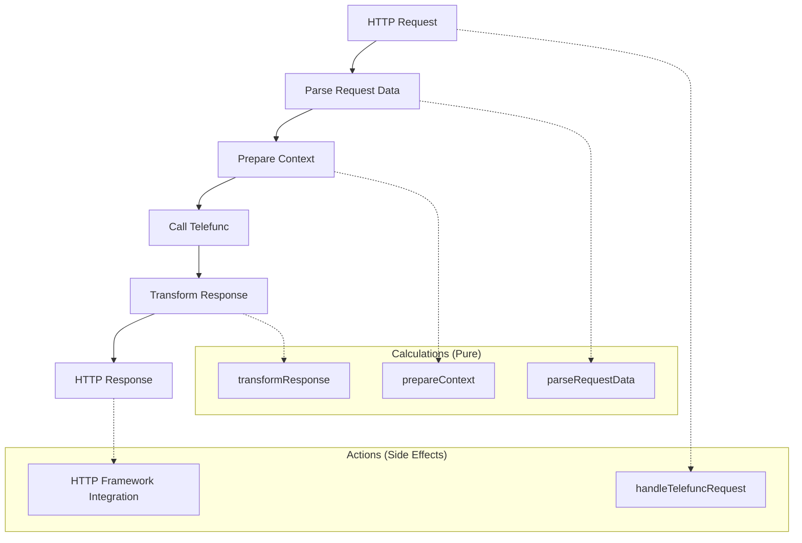

# Telefunc Handler Refactoring Plan

## Current Issues Analysis

The current `telefunc-handler.ts` has several complexity and understandability issues:

1. **Deep nesting**: Complex generic type signature obscures the actual function purpose
2. **Mixed concerns**: HTTP handling, context transformation, and response creation are intertwined
3. **Unclear naming**: The function signature doesn't communicate its intent clearly
4. **Hidden complexity**: Context merging logic is implicit and hard to understand
5. **Poor error handling**: No explicit error boundaries or validation

## Theory & Goal

**Theory**: This module serves as an adapter between the universal-middleware system and the telefunc RPC framework. It should transform HTTP requests into telefunc calls and telefunc responses back to HTTP responses.

**Goal**: Create a clear, understandable interface that separates:
- HTTP request/response handling (actions)
- Data transformation (calculations) 
- Context preparation (calculations)

## Refactoring Strategy

## Proposed Changes

### 1. Extract Pure Functions (Calculations)
- `parseRequestData(request)` - Extract URL, method, body
- `prepareContext(context, runtime, db)` - Merge contexts safely
- `transformResponse(telefuncResponse)` - Convert to HTTP Response

### 2. Simplify Main Handler (Action)
- Create a clear, single-purpose function
- Remove complex generic types
- Add clear parameter and return types

### 3. Improve Module Structure
- **Deep interface**: Simple `createTelefuncHandler()` function
- **Information hiding**: Hide universal-middleware complexity
- **Clear abstractions**: Separate HTTP concerns from RPC concerns

### 4. Add Error Handling
- Validate inputs
- Handle telefunc errors gracefully
- Provide meaningful error responses

### 5. Improve Documentation
- Clear function purpose comments
- Explain context merging strategy
- Document error conditions

## Implementation Steps

1. **Extract calculation functions** - Pure functions for data transformation
2. **Simplify handler signature** - Remove complex generics, use clear types
3. **Add input validation** - Ensure robust error handling
4. **Improve naming** - Use intention-revealing names
5. **Add comprehensive comments** - Explain non-obvious design decisions
6. **Test the refactored code** - Ensure functionality is preserved

## Benefits

- **Reduced complexity**: Clearer separation of concerns
- **Better testability**: Pure functions can be unit tested easily
- **Improved maintainability**: Easier to understand and modify
- **Enhanced error handling**: More robust error boundaries
- **Clearer intent**: Function purpose is immediately obvious
